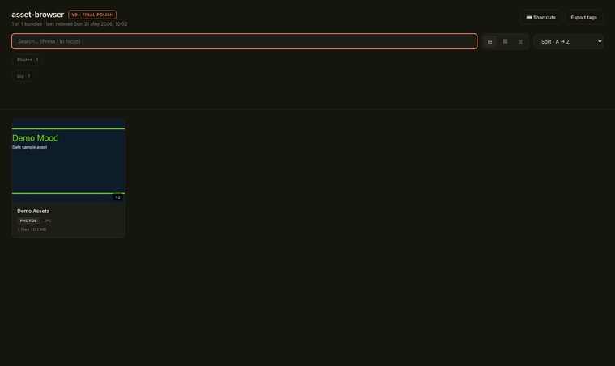
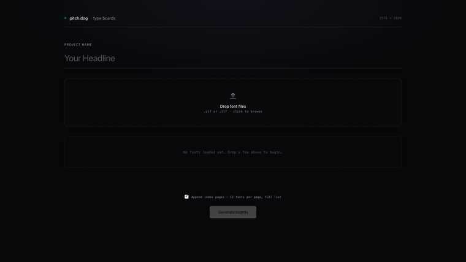
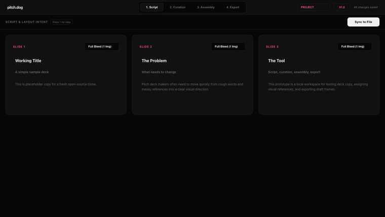

# Pitch Deck Tools

Local, open-source tools by pitch.dog for people who want to make better pitch decks.

This repo is beginner-friendly on purpose. If you have never used GitHub before, start here and go slowly. You do not need to be a professional coder to run these tools.

For an even slower walkthrough, see [docs/getting-started.md](docs/getting-started.md).

## What Is Inside

| Tool | Folder | What it does |
| --- | --- | --- |
| Asset Browser | `tools/asset-browser` | Scans a folder of images, fonts, downloads, and references into a searchable local browser. |
| Font Previewer | `tools/font-previewer` | Lets you compare fonts quickly in large visual type boards. |
| Deck Prototyper | `tools/deck-prototyper` | Helps turn copy and media into rough visual pitch-deck frames. Currently the most active tool. |

## Screenshots

### Asset Browser



### Font Previewer



### Deck Prototyper



## Who This Helps

This project is for people who need to make a pitch deck but cannot afford a professional deck team yet:

- founders preparing an investor deck
- filmmakers and producers making pitch materials
- students and first-time creators learning how decks work
- small teams who need better visual organization
- deck makers who want faster local tools for messy early-stage work

## What You Need

- A Mac or Linux computer.
- Python 3.
- Git, or GitHub Desktop if you prefer a visual app.
- A web browser. Brave Browser Beta is what we use most often, but Chrome, Safari, Firefox, and other modern browsers should work.

### Check Python

Open Terminal and run:

```bash
python3 --version
```

If you see a version number, you are good.

If Python is missing:

- Mac: install Python from [python.org](https://www.python.org/downloads/) or install Xcode Command Line Tools when macOS asks.
- Linux: use your package manager, for example `sudo apt install python3 python3-pil` on Ubuntu/Debian.

## Get The Project From GitHub

### Option A: GitHub Desktop

1. Install GitHub Desktop.
2. Open this repo on GitHub.
3. Click `Code`.
4. Choose `Open with GitHub Desktop`.
5. Pick a folder on your computer.
6. Click `Clone`.

### Option B: Terminal

```bash
git clone https://github.com/bomkino/pitch-deck-tools.git
cd pitch-deck-tools
```

To get updates later:

```bash
git pull
```

## Run The Deck Prototyper

This is the most active tool.

Current prototyper version: `v0.6.0`.

### Mac

Double-click:

```text
tools/deck-prototyper/start-prototyper.command
```

Or use Terminal:

```bash
cd tools/deck-prototyper
python3 app.py
```

### Linux

```bash
cd tools/deck-prototyper
./start-prototyper.sh
```

If the browser does not open automatically, open:

```text
http://localhost:8000/index.html
```

If port `8000` is busy:

```bash
PORT=8010 python3 app.py
```

If you are on a server or Linux setup without a desktop browser:

```bash
PROTOTYPER_OPEN_BROWSER=0 python3 app.py
```

## Run The Asset Browser

### Mac

Double-click:

```text
tools/asset-browser/open-index.command
```

### Linux Or Terminal

```bash
cd tools/asset-browser
./open-index.sh
```

If the browser does not open automatically, copy the URL shown in Terminal.

For best thumbnail support on Linux, install Pillow:

```bash
python3 -m pip install Pillow
```

For video thumbnails, install `ffmpeg`.

## Run The Font Previewer

You can open the HTML files directly:

```text
tools/font-previewer/typeboards.html
tools/font-previewer/figma-font-test-exporter.html
```

Or run a tiny local server:

```bash
cd tools/font-previewer
./start-font-previewer.sh
```

Then open:

```text
http://localhost:8020/typeboards.html
```

## Private Files Stay Private

Do not commit client work, paid fonts, downloaded asset packs, exports, or personal project media.

The repo is set up to ignore common private/local files like:

- `tools/deck-prototyper/_media/`
- `tools/deck-prototyper/deck-copy.txt`
- `tools/deck-prototyper/manifest.json`
- `tools/deck-prototyper/Export/`
- Asset Browser generated thumbnails and indexes
- Font files and private media formats

More detail: [docs/assets-and-privacy.md](docs/assets-and-privacy.md)

## If Something Goes Wrong

### Terminal says permission denied

Run this once:

```bash
chmod +x tools/deck-prototyper/start-prototyper.sh
chmod +x tools/asset-browser/open-index.sh
chmod +x tools/font-previewer/start-font-previewer.sh
```

### Browser says the site cannot be reached

Make sure the Terminal window is still open. These tools run locally from that Terminal process.

### Python cannot import PIL or Pillow

Install Pillow:

```bash
python3 -m pip install Pillow
```

### The wrong version is showing

Stop the server with `Ctrl+C`, run `git pull`, and start the tool again.

## Project Status

This is an active learning project and a real production-adjacent toolkit. Expect rough edges, simple code, and frequent changes.

See [docs/roadmap.md](docs/roadmap.md) for the direction.
